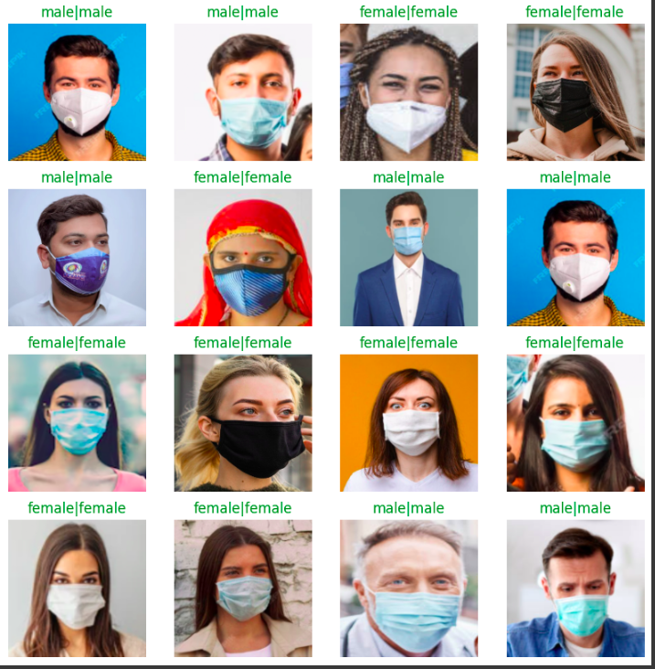

# TASK 3 --> Computer Vission

## Dataset Acquisition
Took about 205 screenshots of people in mask. 

## Approach to Create dataset
- Searched for `images of people with mask on` on google.Found a few sites where I could find high quality straight headshot photograph of a person wearing a face mask. 
- I tried to include as many different ethnicities, races, colors that I could find so that the model is able to classify the general population
- Ensured to make a balanced dataset with equal number of images of females and males,so that my dataset is not skewed towards one group.
- Also deliberately added images of ladies in sarie, wearing bindi and men wearing gamcha so it is better able to classify indian population. 

## Approach to the Problem
- __Using custom model__:
    - In the begging I used a simple CNN model , that consisting of 3 alternating Conv2D and Maxpool layers pair, followed by flatten and dense layers, the model was overfitting so I used Data augmentation, to flip the image randomly along the vertical axis, rotate the image and doing a random zoom , also I added a dropout layer.
    - As a result, I was able to prevent overfitting and was at best case after several epochs able to reach accuracy of 86%.
- __Using Transfer learning__:
    - I used the InceptionV3 model(Excluding its last 2 layers) trained on ImageNet dataset as the base of my model, with its training stopped. On top of that I added 3 Dense layers of my own which would serve the purpose of classifying particular to my dataset.
    - Why I used Transfered learning?
        - The InceptionV3 is already trained on millions of images, so its CNN network is better able to detect any edges,contours, shapes than my custom trained model.
        - So I am using this CNN network to analyse the image better,and then feeding the dense layers with this more accurate description, which is as a result increasing my accuracy.
    - I was able to achieve ~92% with Transfer learning.

### Roadblocks and Measures to Increase Accuracy

During the task, I encountered several challenges:

-  **Finding images**:  
    - It took extra effort to get high quality images of people of different ethnicity , color, etc as I had to make a dataset that would represent different kinds of people.
    - Many images had watermarks and sites had paywall, so had to overcome those.

To increase accuracy, I:

- Fine-tuned model hyperparameters using cross-validation.This includes changing how much I want to augment my data,what should be the patience of early stopping ,selecting the batch size ,etc.
- Used tranfer learning to use InceptionV3 model as the base of my model.

## Instructions to Run the Code
**Link to Hugging face app --> [Link](https://huggingface.co/spaces/AaSiKu/People_in_mask_Classification)**  
**Link to Weights(too large to be uploaded to GitHub) --> [Link](https://drive.google.com/file/d/1c-VYA0HGvXRyN9AUo1dDvMjAaEtv3_Ec/view?usp=sharing)**

To run the code:

1. Clone this repository to your local machine.
2. Upload the `task_3___Aarush_singh_kushwaha copy.ipynb` in colab and read the comments as a guide to run the notebook.
3. Upload the `Female.zip` and `Male.zip` dataset to colab.   
4. Upload the `model_weights.h5` to enjoy the use of the saved weights.  
`NOTE: These weights belong to the Model made with InceptionV3 (ie. the second model)  `  
OR  

Directly run in colab though this [Notebook link](https://colab.research.google.com/drive/1Ka3W4wt2m2Cg91-lJOYMuFgU_NppBl-j?usp=sharing)

**Google Drive links**:
- [Male Images Dataset](https://drive.google.com/drive/folders/1w-XDk6Nu87DuVDsBRrmDTyUhJ0pyxFZy?usp=sharing)  
- [Female Images Dataset](https://drive.google.com/drive/folders/1BAWEUsLpxGbYg2SUGSL_2N6dFM80zxy0?usp=drive_link)

## Screenshots

